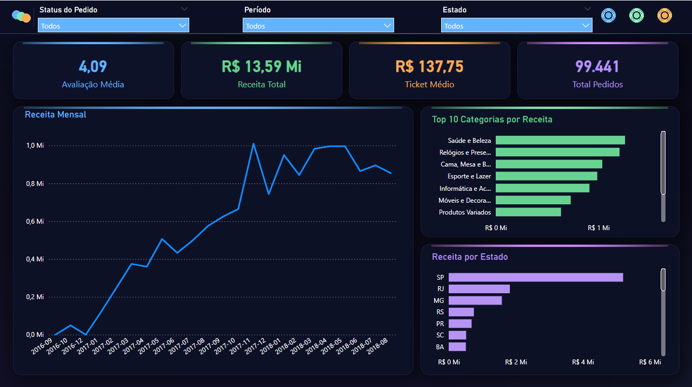

# 📦 Análise de E-commerce — Olist

> Análise completa de dados de um e-commerce brasileiro com SQL avançado, Python e dashboard interativo no Power BI.



---

## 📌 Contexto

A Olist é uma plataforma brasileira que conecta pequenos lojistas a grandes marketplaces. Este projeto analisa **99.441 pedidos** realizados entre setembro de 2016 e agosto de 2018, respondendo a perguntas estratégicas de negócio sobre receita, satisfação de clientes e logística.

---

## ❓ Problema de Negócio

> *Quais categorias, regiões e períodos geram mais receita — e onde estão os maiores gargalos de entrega e satisfação do cliente?*

A partir dessa pergunta central, três hipóteses foram investigadas:

1. O tempo de entrega impacta diretamente a avaliação do cliente?
2. Existe concentração geográfica de receita?
3. Qual é a taxa de retenção de clientes da plataforma?

---

## 🗂️ Estrutura do Projeto

```
olist-ecommerce-analysis/
│
├── data/                              # Dados brutos (não versionados)
│
├── notebooks/
│   ├── ETL/
│   │   ├── extract.ipynb             # Extração — leitura dos CSVs brutos
│   │   ├── transform.ipynb           # Transformação — limpeza, traduções e agregações
│   │   └── load.ipynb                # Carga — inserção dos dados no PostgreSQL
│   └── analise.ipynb                 # Análise exploratória e geração de gráficos
│
├── sql/
│   ├── criar_tabelas.sql             # DDL das tabelas no PostgreSQL
│   └── analises.sql                  # Queries com CTEs e Window Functions
│
├── dashboard/
│   └── Olist-Ecommerce-Analysis.pbix # Dashboard interativo no Power BI
│
├── reports/                          # Gráficos exportados
│   ├── vendas_mensais.png
│   ├── top_categorias.png
│   └── entrega_vs_avaliacao.png
│
├── .env                              # Variáveis de ambiente (não versionado)
├── .gitignore
└── README.md
```

---

## 🛠️ Tecnologias Utilizadas

| Ferramenta | Uso |
|---|---|
| **Python 3** | Limpeza, transformação e análise exploratória |
| **Pandas** | Manipulação de DataFrames |
| **Matplotlib** | Visualizações exploratórias |
| **PostgreSQL** | Banco de dados relacional para armazenamento e consultas |
| **SQLAlchemy** | Conexão Python ↔ PostgreSQL |
| **SQL (CTEs + Window Functions)** | Análises avançadas de negócio |
| **Power BI + DAX** | Dashboard interativo |
| **Git / GitHub** | Versionamento de código |
| **python-dotenv** | Gerenciamento seguro de credenciais |

---

## 🔄 Pipeline de Dados

```
Kaggle (CSV brutos)
       │
       ▼
notebooks/ETL/extract.ipynb
  └── Leitura dos CSVs via Pandas
       │
       ▼
notebooks/ETL/transform.ipynb
  └── Conversão de tipos e datas
  └── Tradução de categorias e status para português
  └── Criação da tabela vendas_mensais (agregação mensal)
  └── Remoção de meses incompletos (set/2018)
       │
       ▼
notebooks/ETL/load.ipynb
  └── Carga de todas as tabelas no PostgreSQL via SQLAlchemy
       │
       ▼
PostgreSQL (banco: olist)
  └── orders, order_items, customers
  └── products, reviews, category_translation
  └── vendas_mensais
       │
       ▼
notebooks/analise.ipynb
  └── Análise exploratória dos dados
  └── Geração de gráficos e métricas de negócio
       │
       ▼
sql/analises.sql
  └── Queries com CTEs e Window Functions
  └── Análises por estado, categoria e tempo de entrega
       │
       ▼
Power BI (conectado diretamente ao PostgreSQL)
  └── Medidas DAX
  └── Segmentações interativas
  └── Dashboard com capa
```

---

## 📊 Principais Análises

### 1. Evolução de Receita Mensal
A receita cresceu de forma consistente entre janeiro e novembro de 2017, atingindo o pico de **R$ 1 milhão** em novembro de 2017 — possivelmente impulsionado pela Black Friday. Os dados vão até agosto de 2018, quando a receita se mantinha estável em torno de R$ 850 mil mensais.

### 2. Top 10 Categorias por Receita
| Categoria | Receita Total | % da Receita |
|---|---|---|
| Saúde e Beleza | R$ 1.233.131 | 9,45% |
| Relógios e Presentes | R$ 1.166.176 | 8,94% |
| Cama, Mesa e Banho | R$ 1.023.434 | 7,85% |
| Esporte e Lazer | R$ 954.852 | 7,32% |
| Informática e Acessórios | R$ 888.724 | 6,81% |

### 3. Receita por Estado
São Paulo concentra **R$ 5 milhões** em receita — quase 40% do total. Estados do Nordeste como Paraíba (PB) e Alagoas (AL) apresentam os maiores tickets médios, indicando oportunidade de crescimento nessas regiões.

### 4. Tempo de Entrega vs. Avaliação ⭐
| Nota | Tempo médio de entrega |
|---|---|
| ⭐ 1 | 20,9 dias |
| ⭐ 2 | 16,2 dias |
| ⭐ 3 | 13,8 dias |
| ⭐ 4 | 11,8 dias |
| ⭐ 5 | 10,2 dias |

Clientes que recebem em até 10 dias dão nota 5. Clientes que esperam mais de 20 dias dão nota 1. A correlação é direta e linear.

### 5. Taxa de Recompra
| Pedidos por cliente | % de clientes |
|---|---|
| 1 pedido | 97,00% |
| 2 pedidos | 2,76% |
| 3+ pedidos | 0,24% |

**97% dos clientes compraram apenas uma vez.** A plataforma depende quase inteiramente de aquisição de novos clientes para crescer.

---

## 💡 Insights e Recomendações

### Insight 1 — Entrega é o principal driver de satisfação
Reduzir o tempo médio de entrega de 20 para 12 dias nos pedidos com nota baixa poderia elevar a avaliação média de 1 para 3-4 estrelas, impactando diretamente reputação e recompra.

**Recomendação:** Priorizar parceiros logísticos com melhor SLA nas regiões com maior tempo de entrega, especialmente Norte e Nordeste.

### Insight 2 — Taxa de retenção crítica
Com 97% dos clientes fazendo apenas uma compra, o custo de aquisição de clientes (CAC) é muito alto.

**Recomendação:** Implementar campanha de reativação para os 90.557 clientes que compraram apenas uma vez, com foco nas categorias de maior ticket médio como Relógios e Presentes (R$ 199 de ticket médio).

---

## 📁 Como Reproduzir

### Pré-requisitos
- Python 3.8+
- PostgreSQL 13+
- Power BI Desktop

### Passos

```bash
# 1. Clone o repositório
git clone https://github.com/RayranTech/olist-ecommerce-analysis.git
cd olist-ecommerce-analysis

# 2. Instale as dependências
pip install pandas matplotlib sqlalchemy psycopg2-binary jupyter python-dotenv

# 3. Configure as variáveis de ambiente
# Crie um arquivo .env na raiz com:
# DB_PASSWORD=sua_senha_aqui

# 4. Baixe o dataset
# Acesse: https://www.kaggle.com/datasets/olistbr/brazilian-ecommerce
# Extraia os CSVs na pasta /data

# 5. Crie o banco de dados no PostgreSQL
# CREATE DATABASE olist;
# Execute: sql/criar_tabelas.sql

# 6. Execute os notebooks na ordem
# notebooks/ETL/extract.ipynb
# notebooks/ETL/transform.ipynb
# notebooks/ETL/load.ipynb
# notebooks/analise.ipynb

# 7. Execute as queries SQL
# sql/analises.sql

# 8. Abra o dashboard
# dashboard/Olist-Ecommerce-Analysis.pbix
# Conecte ao PostgreSQL local com suas credenciais
```

---

## 📬 Contato

[GitHub](https://github.com/RayranTech)

---

*Dataset: [Brazilian E-Commerce Public Dataset by Olist](https://www.kaggle.com/datasets/olistbr/brazilian-ecommerce) — disponível no Kaggle sob licença CC BY-NC-SA 4.0*
